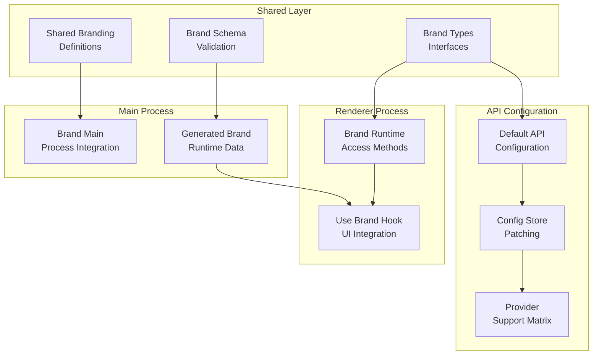
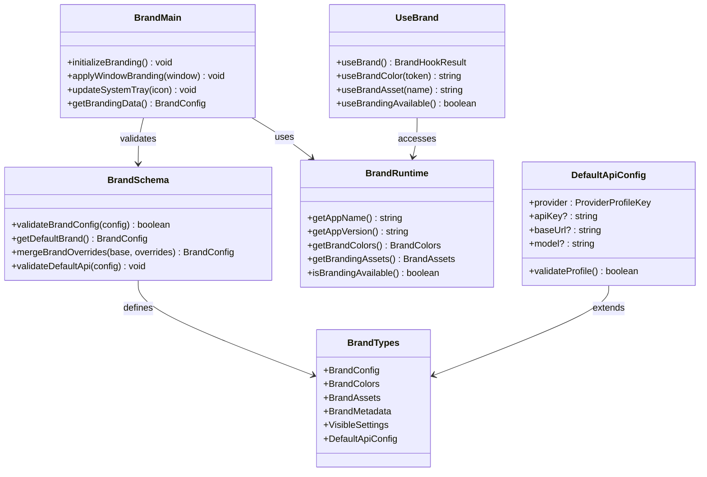
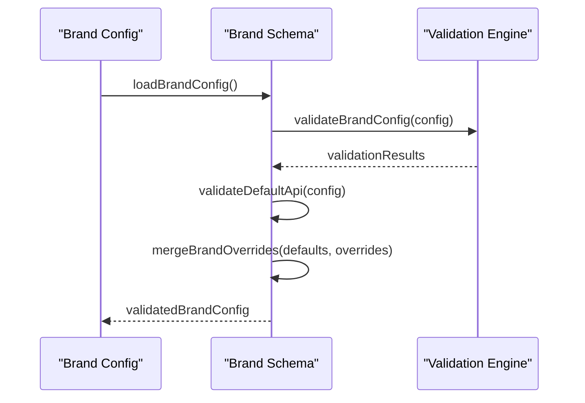
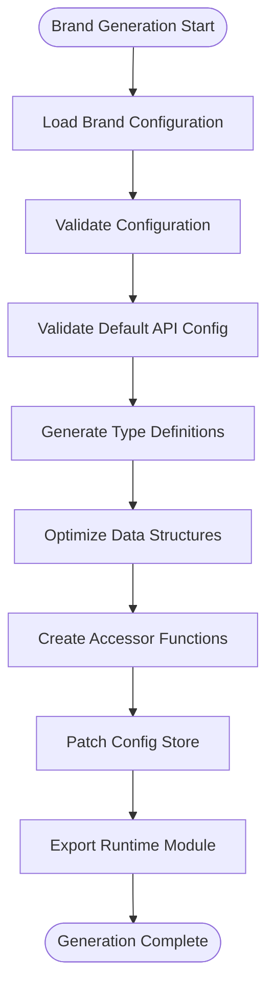
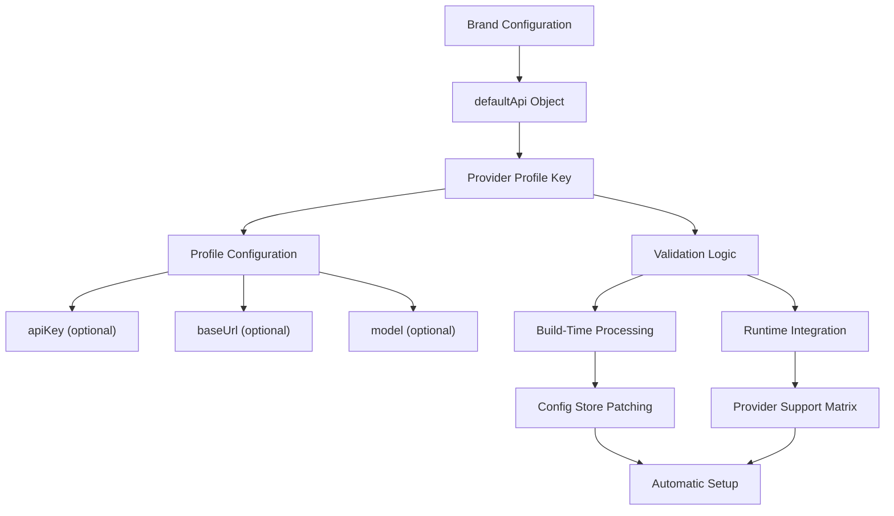
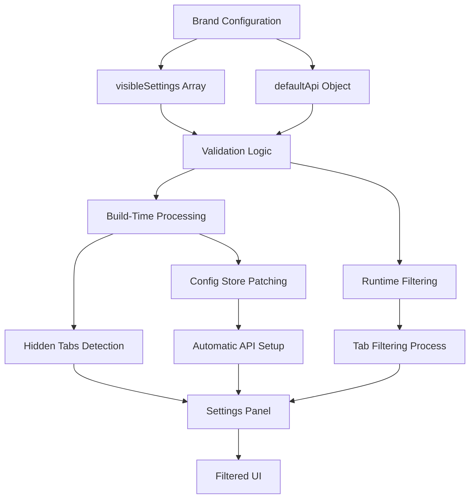
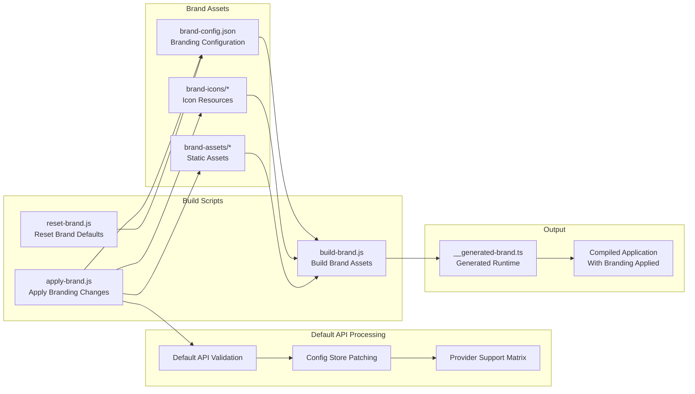
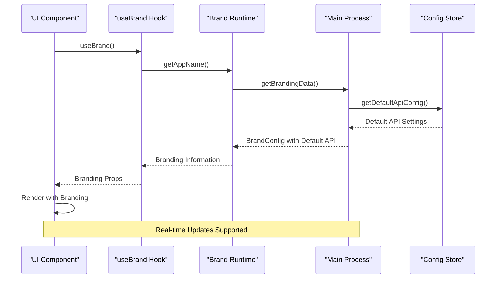
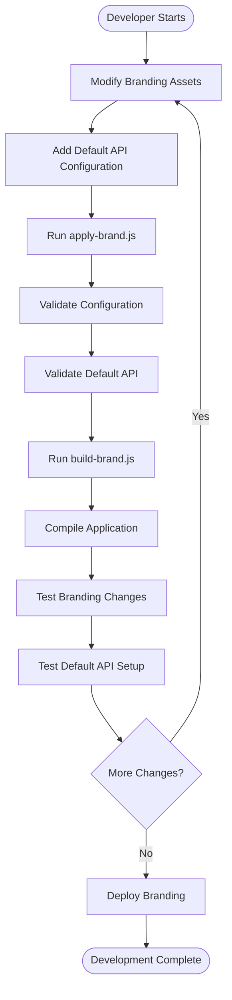

# Branding System

<cite>
**Referenced Files in This Document**
- [brand-main.ts](file://src/main/branding/brand-main.ts)
- [__generated-brand.ts](file://src/shared/branding/__generated-brand.ts)
- [brand-runtime.ts](file://src/shared/branding/brand-runtime.ts)
- [brand-schema.ts](file://src/shared/branding/brand-schema.ts)
- [brand-types.ts](file://src/shared/branding/brand-types.ts)
- [apply-brand.js](file://scripts/apply-brand.js)
- [build-brand.js](file://scripts/build-brand.js)
- [reset-brand.js](file://scripts/reset-brand.js)
- [useBrand.ts](file://src/renderer/hooks/useBrand.ts)
- [SettingsPanel.tsx](file://src/renderer/components/SettingsPanel.tsx)
- [config-store.ts](file://src/main/config/config-store.ts)
</cite>

## Update Summary

**Changes Made**

- Added comprehensive documentation for new default API configuration capabilities
- Updated build system to support automatic API configuration store patching
- Enhanced TypeScript interfaces with defaultApi property for provider profiles
- Added validation logic for default API configuration including provider keys and fields
- Integrated default API settings with existing settings visibility feature

## Table of Contents

1. [Introduction](#introduction)
2. [Project Structure](#project-structure)
3. [Core Components](#core-components)
4. [Architecture Overview](#architecture-overview)
5. [Detailed Component Analysis](#detailed-component-analysis)
6. [Default API Configuration System](#default-api-configuration-system)
7. [Settings Visibility Feature](#settings-visibility-feature)
8. [Build System Enhancements](#build-system-enhancements)
9. [Runtime Branding Integration](#runtime-branding-integration)
10. [Development Workflow](#development-workflow)
11. [Troubleshooting Guide](#troubleshooting-guide)
12. [Conclusion](#conclusion)

## Introduction

The Open Cowork branding system is a comprehensive framework designed to enable customizable branding for the Electron-based desktop application. This system allows developers to modify visual elements such as application icons, window decorations, splash screens, and other UI components while maintaining a consistent user experience across different branded deployments.

The branding system operates through a multi-layered architecture that separates build-time branding from runtime customization, ensuring flexibility while maintaining performance and reliability. It supports both development and production environments with automated tooling for seamless branding updates.

**Updated** Added comprehensive default API configuration capabilities allowing organizations to define default API providers, base URLs, and models directly within brand settings. This enhancement enables automatic configuration of AI providers including OpenRouter, Anthropic, OpenAI, Gemini, Ollama, and custom variants, with enhanced validation system and automatic configuration store patching.

## Project Structure

The branding system is organized across three primary layers: shared branding definitions, main process branding integration, and renderer process branding hooks. This separation ensures clean boundaries between Electron's main and renderer processes while providing unified access to branding information.

**Diagram sources**

- [brand-main.ts:1-50](file://src/main/branding/brand-main.ts#L1-L50)
- [\_\_generated-brand.ts:1-80](file://src/shared/branding/__generated-brand.ts#L1-L80)
- [brand-runtime.ts:1-60](file://src/shared/branding/brand-runtime.ts#L1-L60)
- [brand-types.ts:1-120](file://src/shared/branding/brand-types.ts#L1-L120)
- [apply-brand.js:190-218](file://scripts/apply-brand.js#L190-L218)
- [config-store.ts:1-100](file://src/main/config/config-store.ts#L1-L100)

**Section sources**

- [brand-main.ts:1-100](file://src/main/branding/brand-main.ts#L1-L100)
- [brand-schema.ts:1-80](file://src/shared/branding/brand-schema.ts#L1-L80)
- [brand-types.ts:1-80](file://src/shared/branding/brand-types.ts#L1-L80)

## Core Components

The branding system consists of several interconnected components that work together to provide comprehensive branding capabilities:

### Shared Branding Definitions

The shared layer contains type definitions and validation schemas that ensure consistency across all application layers. These definitions establish the contract for branding data structures and provide TypeScript interfaces for type-safe access.

### Main Process Integration

The main process component handles Electron-specific branding operations, including window decorations, menu bar customization, and system tray integration. This layer bridges the gap between branding definitions and Electron's native APIs.

### Renderer Process Hooks

The renderer process provides React hooks that enable UI components to access branding information dynamically. These hooks facilitate responsive design and allow for real-time branding updates without requiring application restarts.

**Updated** Enhanced with default API configuration support that allows organizations to define provider-specific settings directly in brand configurations, enabling automatic setup of AI providers during application initialization.

**Section sources**

- [\_\_generated-brand.ts:1-120](file://src/shared/branding/__generated-brand.ts#L1-L120)
- [brand-runtime.ts:1-100](file://src/shared/branding/brand-runtime.ts#L1-L100)
- [useBrand.ts:1-80](file://src/renderer/hooks/useBrand.ts#L1-L80)

## Architecture Overview

The branding system follows a layered architecture pattern that separates concerns between build-time configuration, runtime access, and UI integration. This design enables flexible branding while maintaining performance and type safety.

**Diagram sources**

- [brand-schema.ts:1-100](file://src/shared/branding/brand-schema.ts#L1-L100)
- [brand-types.ts:1-120](file://src/shared/branding/brand-types.ts#L1-L120)
- [brand-main.ts:1-120](file://src/main/branding/brand-main.ts#L1-L120)
- [brand-runtime.ts:1-120](file://src/shared/branding/brand-runtime.ts#L1-L120)
- [useBrand.ts:1-100](file://src/renderer/hooks/useBrand.ts#L1-L100)
- [apply-brand.js:190-218](file://scripts/apply-brand.js#L190-L218)

## Detailed Component Analysis

### Brand Schema Validation

The brand schema component serves as the foundation for all branding validation and configuration management. It provides methods for validating brand configurations, merging overrides, and establishing default values.

**Diagram sources**

- [brand-schema.ts:1-80](file://src/shared/branding/brand-schema.ts#L1-L80)
- [apply-brand.js:190-218](file://scripts/apply-brand.js#L190-L218)

**Section sources**

- [brand-schema.ts:1-120](file://src/shared/branding/brand-schema.ts#L1-L120)

### Generated Brand Runtime

The generated brand runtime component creates optimized access patterns for branding data. It generates type-safe interfaces and provides efficient lookup mechanisms for branding assets and metadata.

**Diagram sources**

- [\_\_generated-brand.ts:1-100](file://src/shared/branding/__generated-brand.ts#L1-L100)
- [apply-brand.js:693-787](file://scripts/apply-brand.js#L693-L787)

**Section sources**

- [\_\_generated-brand.ts:1-150](file://src/shared/branding/__generated-brand.ts#L1-L150)

### Main Process Brand Integration

The main process integration handles Electron-specific branding operations including window customization, system tray updates, and menu bar modifications. This component ensures that branding changes are applied consistently across all application windows.

**Section sources**

- [brand-main.ts:1-200](file://src/main/branding/brand-main.ts#L1-L200)

### Renderer Process Brand Hooks

The renderer process provides React hooks that enable UI components to access branding information dynamically. These hooks facilitate responsive design and allow for real-time branding updates without requiring application restarts.

**Section sources**

- [useBrand.ts:1-120](file://src/renderer/hooks/useBrand.ts#L1-L120)

## Default API Configuration System

**New** The default API configuration system provides comprehensive support for automatically setting up AI provider configurations based on brand specifications. This system enables organizations to define default API providers, base URLs, and models directly within their brand settings.

### Configuration Structure

The default API configuration is defined through the `defaultApi` property in brand configuration, which accepts a single provider profile object with optional API key, base URL, and model settings.

**Diagram sources**

- [apply-brand.js:190-218](file://scripts/apply-brand.js#L190-L218)
- [apply-brand.js:693-787](file://scripts/apply-brand.js#L693-L787)
- [brand-types.ts:1-120](file://src/shared/branding/brand-types.ts#L1-L120)

### Supported Providers

The default API configuration system supports the following provider profiles:

- **OpenRouter**: `{"openrouter": {"apiKey": "your-key", "baseUrl": "https://openrouter.ai/api/v1", "model": "openai/gpt-4-turbo"}}`
- **Anthropic**: `{"anthropic": {"apiKey": "your-key", "baseUrl": "https://api.anthropic.com/v1", "model": "claude-3-opus"}}`
- **OpenAI**: `{"openai": {"apiKey": "your-key", "baseUrl": "https://api.openai.com/v1", "model": "gpt-4-turbo"}}`
- **Gemini**: `{"google": {"apiKey": "your-key", "baseUrl": "https://generativelanguage.googleapis.com/v1beta", "model": "gemini-pro"}}`
- **Ollama**: `{"ollama": {"baseUrl": "http://localhost:11434/api", "model": "llama3"}}`
- **Custom**: Any custom provider with `{"custom": {"apiKey": "key", "baseUrl": "https://api.example.com/v1", "model": "model-name"}}`

### Validation and Processing

The default API configuration undergoes comprehensive validation during the build process:

1. **Provider Key Validation**: Ensures exactly one provider key exists and is valid
2. **Profile Object Validation**: Validates that the profile is a proper object
3. **Field Validation**: Checks that apiKey, baseUrl, and model are strings when provided
4. **Auto-Setup Integration**: Automatically patches the configuration store with validated settings

**Section sources**

- [apply-brand.js:190-218](file://scripts/apply-brand.js#L190-L218)
- [apply-brand.js:693-787](file://scripts/apply-brand.js#L693-L787)
- [brand-types.ts:1-120](file://src/shared/branding/brand-types.ts#L1-L120)

## Settings Visibility Feature

**Updated** The settings visibility feature now works seamlessly with the default API configuration system, ensuring that settings tabs remain accessible while providing automatic API setup capabilities.

### Configuration Structure

The settings visibility feature is controlled through the `visibleSettings` property in brand configuration, which accepts an array of tab identifiers that should be displayed.

**Diagram sources**

- [apply-brand.js:567-610](file://scripts/apply-brand.js#L567-L610)
- [apply-brand.js:693-787](file://scripts/apply-brand.js#L693-L787)
- [SettingsPanel.tsx:54-64](file://src/renderer/components/SettingsPanel.tsx#L54-L64)

### Implementation Details

The settings visibility feature implements both build-time and runtime filtering mechanisms:

1. **Build-Time Filtering**: The `apply-brand.js` script analyzes the `visibleSettings` configuration and injects tab filtering logic directly into the `SettingsPanel.tsx` component during the build process.

2. **Runtime Filtering**: The `SettingsPanel` component includes dynamic tab filtering that respects the branding configuration while maintaining runtime flexibility.

3. **Fallback Mechanisms**: The system ensures that essential tabs (particularly the 'general' tab) remain accessible even when visibility configurations change.

4. **Integration with Default API**: The default API configuration system works alongside settings visibility to provide automatic setup without interfering with tab visibility controls.

**Section sources**

- [apply-brand.js:567-610](file://scripts/apply-brand.js#L567-L610)
- [SettingsPanel.tsx:54-64](file://src/renderer/components/SettingsPanel.tsx#L54-L64)

## Build System Enhancements

**Updated** The build system has been significantly enhanced to support default API configuration capabilities, including automatic configuration store patching and comprehensive validation.

**Diagram sources**

- [apply-brand.js:1-80](file://scripts/apply-brand.js#L1-L80)
- [build-brand.js:1-80](file://scripts/build-brand.js#L1-L80)
- [reset-brand.js:1-80](file://scripts/reset-brand.js#L1-L80)
- [apply-brand.js:190-218](file://scripts/apply-brand.js#L190-L218)
- [apply-brand.js:693-787](file://scripts/apply-brand.js#L693-L787)

### Apply Brand Script Enhancements

The apply brand script now includes comprehensive default API configuration processing:

1. **Default API Validation**: Validates the `defaultApi` configuration with strict provider key and field validation
2. **TypeScript Interface Updates**: Automatically patches `brand-types.ts` to include the `defaultApi` property
3. **Configuration Store Patching**: Integrates default API settings into the application's configuration system
4. **Provider Support Integration**: Ensures compatibility with the supported provider matrix

**Updated** Enhanced with settings visibility processing that injects tab filtering logic into the SettingsPanel component based on the `visibleSettings` configuration.

**Section sources**

- [apply-brand.js:1-120](file://scripts/apply-brand.js#L1-L120)
- [apply-brand.js:190-218](file://scripts/apply-brand.js#L190-L218)
- [apply-brand.js:693-787](file://scripts/apply-brand.js#L693-L787)

### Build Brand Script

The build brand script generates optimized runtime code from branding configurations. It processes brand assets, validates configurations, and produces the final compiled branding module.

**Section sources**

- [build-brand.js:1-120](file://scripts/build-brand.js#L1-L120)

### Reset Brand Script

The reset brand script restores default branding configurations and removes custom branding assets. This script is essential for development workflows and troubleshooting branding issues.

**Section sources**

- [reset-brand.js:1-120](file://scripts/reset-brand.js#L1-L120)

## Runtime Branding Integration

The runtime branding system provides dynamic access to branding information throughout the application lifecycle. It enables real-time updates and maintains consistency across all application components.

**Diagram sources**

- [useBrand.ts:1-100](file://src/renderer/hooks/useBrand.ts#L1-L100)
- [brand-runtime.ts:1-100](file://src/shared/branding/brand-runtime.ts#L1-L100)
- [config-store.ts:1-100](file://src/main/config/config-store.ts#L1-L100)

**Section sources**

- [brand-runtime.ts:1-150](file://src/shared/branding/brand-runtime.ts#L1-L150)

## Development Workflow

The development workflow for the branding system emphasizes iterative development and rapid feedback cycles. Developers can modify branding assets and see changes reflected immediately in the application.

**Diagram sources**

- [apply-brand.js:1-100](file://scripts/apply-brand.js#L1-L100)
- [build-brand.js:1-100](file://scripts/build-brand.js#L1-L100)

### Development Best Practices

1. **Asset Organization**: Maintain a clear hierarchy for branding assets with separate directories for icons, images, and configuration files.

2. **Default API Configuration**: When adding default API settings, ensure provider keys match supported profiles and include appropriate validation.

3. **Validation First**: Always validate branding configurations before applying changes to prevent runtime errors.

4. **Incremental Testing**: Test branding changes incrementally to identify issues early in the development cycle.

5. **Backup Strategy**: Maintain backups of original branding assets to enable quick restoration if needed.

6. **Settings Visibility Testing**: When configuring settings visibility, test both build-time and runtime filtering to ensure proper tab display behavior.

7. **Default API Testing**: Verify that default API configurations are properly applied and that the configuration store is correctly patched.

## Troubleshooting Guide

Common issues and solutions for the branding system:

### Configuration Validation Errors

**Symptoms**: Branding configuration fails validation during build process
**Causes**: Missing required fields, invalid asset paths, or incorrect data types
**Solutions**:

- Verify all required fields are present in brand configuration
- Check asset file paths and ensure files exist
- Validate data types match expected schema definitions

### Default API Configuration Issues

**Symptoms**: Default API settings not applied or causing errors
**Causes**: Invalid provider keys, missing required fields, or incorrect data types
**Solutions**:

- Verify provider keys match supported profiles (openrouter, anthropic, openai, google, ollama, custom)
- Ensure exactly one provider key exists in the defaultApi object
- Check that apiKey, baseUrl, and model fields are strings when provided
- Validate that the configuration store patching completes successfully

### Asset Loading Issues

**Symptoms**: Branding assets not displaying correctly in application
**Causes**: Incorrect asset paths, missing asset files, or unsupported formats
**Solutions**:

- Verify asset file extensions are supported
- Check asset file permissions and accessibility
- Ensure asset paths match configured locations

### Runtime Access Problems

**Symptoms**: Branding information not available in UI components
**Causes**: Runtime initialization failures or hook usage errors
**Solutions**:

- Verify branding system initialization completes successfully
- Check React hook usage patterns and dependencies
- Review console logs for initialization errors

### Settings Visibility Issues

**Symptoms**: Settings tabs not displaying correctly or hidden unexpectedly
**Causes**: Invalid `visibleSettings` configuration, missing tab identifiers, or filtering logic errors
**Solutions**:

- Verify all tab identifiers in `visibleSettings` are valid (api, sandbox, connectors, skills, memory, schedule, remote, logs, general)
- Ensure the 'general' tab is always included in visibility configurations
- Check build logs for settings panel patching errors
- Test runtime filtering behavior with different tab configurations

### Configuration Store Patching Issues

**Symptoms**: Default API settings not persisting or not taking effect
**Causes**: Configuration store patching failures or invalid provider profiles
**Solutions**:

- Verify that the defaultApi configuration is properly formatted
- Check that the configuration store patching process completes without errors
- Ensure that the provider profile matches supported configurations
- Review console logs for configuration store modification errors

**Section sources**

- [brand-schema.ts:1-80](file://src/shared/branding/brand-schema.ts#L1-L80)
- [brand-main.ts:1-100](file://src/main/branding/brand-main.ts#L1-L100)
- [apply-brand.js:190-218](file://scripts/apply-brand.js#L190-L218)
- [apply-brand.js:693-787](file://scripts/apply-brand.js#L693-L787)

## Conclusion

The Open Cowork branding system provides a robust, scalable solution for managing application branding across different deployment scenarios. Its layered architecture ensures maintainability while supporting dynamic branding updates and comprehensive customization capabilities.

The system's strength lies in its separation of concerns, with clear boundaries between build-time configuration, runtime access, and UI integration. This design enables developers to modify branding elements efficiently while maintaining application stability and performance.

**Updated** Recent enhancements include comprehensive default API configuration capabilities that allow organizations to define provider-specific settings directly in brand configurations. The default API system provides automatic setup of AI providers including OpenRouter, Anthropic, OpenAI, Gemini, Ollama, and custom variants, with enhanced validation and automatic configuration store patching.

Key benefits of the current implementation include:

- Type-safe branding configurations with default API support
- Dynamic runtime access patterns with automatic API setup
- Comprehensive validation and error handling for both branding and API configurations
- Seamless integration with Electron's native APIs
- Support for both development and production workflows
- Configurable settings tabs visibility for tailored user experiences
- Automatic configuration store patching for streamlined deployment
- Extensive provider support matrix for diverse AI integration needs

Future enhancements could include expanded asset format support, advanced color scheme generation, automated branding preview capabilities, additional customization options for the settings interface, and enhanced provider-specific configuration options.
